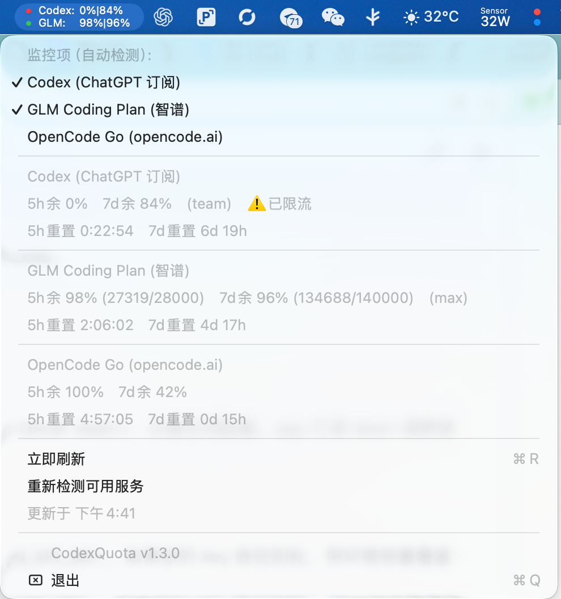

# CodexQuota

<p align="center"><b>macOS 菜单栏 AI 编程订阅额度监控</b><br>一个状态栏图标，同时盯住 Codex 与 GLM Coding Plan 的 5 小时 / 每周剩余额度</p>

```
 🔴 Codex:0%|84%      ← 红点 = 5小时窗口已用满
 🟢 GLM:98%|96%
 🟢 OpenCode:100%|42%
```

白色等宽文字 + 彩色状态点，与 macOS 菜单栏原生风格一致。同一状态项内多行叠显，每个被监控的服务占一行，点击菜单即可勾选显示哪些。

<p align="center"></p>

## 功能

- **自动检测已配置的服务**：启动时探测本机凭证（Codex 的 OAuth token、GLM / OpenCode 的 API Key），菜单里列出所有检测到的 coding plan 及其状态，未配置的灰显并给出配置提示；也可点「重新检测可用服务」
- **菜单勾选监控项**：取消勾选即从状态栏隐藏；新检测到的服务自动显示，选择自动记忆
- **刷新间隔可选**：1 / 5 / 10 / 15 / 30 分钟，菜单里直接切换
- **开机自启动开关**：菜单里一键开关（SMAppService，可在系统设置 → 登录项中看到）
- **应用自更新**：点「立即更新」自动检查 GitHub 最新 release，有新版则下载源码、本机重编译、原地替换并重启，全程无需重装
- **Codex（ChatGPT 订阅）**：5 小时窗口 + 每周窗口剩余百分比、重置倒计时、限流状态、套餐类型
- **GLM Coding Plan（智谱）**：5 小时 + 每周积分余额（精确到点数）、套餐档位（lite/pro/max）、重置时间
- **OpenCode Go（opencode.ai）**：滚动窗口 + 每周窗口剩余百分比与重置倒计时
- **状态栏两列对齐**：标签列宽度取各行最宽值，无论数值多少，各行的百分比始终垂直对齐
- **状态点三色**：🟢 余量 > 40%　🟡 11–40%　🔴 ≤ 10% 或已限流
- 5 分钟自动刷新（可 ⌘R 手动），重置倒计时本地每 30 秒刷新
- 零配置后台运行：无 Dock 图标、CPU 占用 ~0%、内存 ~50MB

## 系统要求

- macOS 13.0+
- Codex 监控：本机已用 ChatGPT 账号登录过 Codex CLI（存在 `~/.codex/auth.json`）
- GLM 监控：拥有智谱 GLM Coding Plan 的 API Key

## 安装

### 方式一：一条命令安装（推荐）

```bash
curl -fsSL https://raw.githubusercontent.com/sergioperezcheco/CodexQuota/main/scripts/install.sh | bash
```

脚本做的事：`git clone` → `swiftc` 编译（需要 Xcode Command Line Tools）→ 打包 `.app` → 放入 `/Applications` → 启动并注册登录项。全程约 30 秒。

### 方式二：手动安装

```bash
git clone https://github.com/sergioperezcheco/CodexQuota.git
cd CodexQuota
# 首次编译需要 Xcode Command Line Tools: xcode-select --install
swiftc -O -o CodexQuota Sources/codex_quota.swift
mkdir -p CodexQuota.app/Contents/MacOS
mv CodexQuota CodexQuota.app/Contents/MacOS/
cp Info.plist CodexQuota.app/Contents/
cp -r CodexQuota.app /Applications/
open /Applications/CodexQuota.app
```

如需开机自启动：系统设置 → 通用 → 登录项 → 添加 CodexQuota。

## 配置

### Codex

只要你在本机登录过 Codex CLI（`~/.codex/auth.json` 存在 OAuth token），无需任何配置。app 只读 token 调用官方 usage 接口，**不会上传任何数据**。

### GLM Coding Plan

app 默认从 `~/.hermes/.env` 读取 `CUSTOM_OPEN_BIGMODEL_CN_API_KEY`。如果你的 key 放在别处，用环境变量覆盖：

```bash
# launchctl 方式（重启后仍有效）
launchctl setenv GLM_API_KEY "你的key"

# 或写入 shell 配置 (~/.zshrc)
export GLM_API_KEY="你的key"
```

优先级：`GLM_API_KEY` 环境变量 > `~/.hermes/.env` 中的 `CUSTOM_OPEN_BIGMODEL_CN_API_KEY`。

> 注意：这只影响 GLM 监控读哪个 key。额度按账号统计——监控哪个 key 就显示哪个账号的额度。

### OpenCode Go

app 默认按顺序读取 `OPENCODE_API_KEY` 环境变量和 `~/.hermes/.env` 中的 `OPENCODE_GO_API_KEY`。也可以显式设置：

```bash
launchctl setenv OPENCODE_API_KEY "你的key"
```

> 额度接口 `GET opencode.ai/zen/go/v1/usage` 由 OpenCode 官方提供但未公开文档，且位于 Cloudflare 之后——app 已内置浏览器 UA，普通请求会被 403 (error 1010) 拦截。

## 使用

点击菜单栏图标：

```
监控项（自动检测）:
  ✓ Codex (ChatGPT 订阅)
  ✓ GLM Coding Plan (智谱)
  ✓ OpenCode Go (opencode.ai)
────────────────
Codex (ChatGPT 订阅)
  5h余 0%　7d余 84%　(team)　⚠️已限流
  5h重置 2:47:31　7d重置 6d 23h
────────────────
GLM Coding Plan (智谱)
  5h余 98% (27432/28000)　7d余 96% (135593/140000)　(max)
  5h重置 3:12:44　7d重置 6d 18h
────────────────
OpenCode Go (opencode.ai)
  5h余 100%　7d余 42%
  5h重置 0:04:12　7d重置 0d 7h
────────────────
立即刷新      ⌘R
刷新间隔:
  ✓ 5 分钟
    10 分钟
    15 分钟
    30 分钟
────────────────
  ✓ 开机自启动
  立即更新      ⌘U
  重新检测可用服务
更新于 下午4:41
────────────────
CodexQuota v1.4.0
退出          ⌘Q
```

- 菜单里点各监控项即可在状态栏显示/隐藏（至少保留一项）
- 新配置了某个服务的凭证后，点「重新检测可用服务」即可让它出现在列表里

## 工作原理

| | 端点 | 凭证 |
|---|---|---|
| Codex | `GET chatgpt.com/backend-api/wham/usage` | `~/.codex/auth.json` 的 OAuth access_token |
| GLM | `GET open.bigmodel.cn/api/monitor/usage/quota/limit` | GLM Coding Plan API Key |

两个都是官方接口、纯 GET、只读。app 不收集、不上传任何数据；所有请求直接从你的机器发往对应服务。

## 目录结构

```
CodexQuota/
├── Sources/codex_quota.swift   # 全部源码（单文件，~450 行）
├── Info.plist                  # bundle 配置
├── scripts/install.sh          # 一键安装脚本
└── README.md
```

## License

MIT
